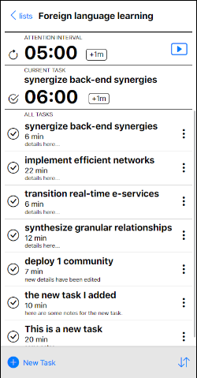

# Focus Interval

## Description
This app is like a task management tool and a pomodoro timer mashed together.  Using this tool, users can add their list of tasks with an estimated time for each.  When the time for each task is up, the app will check in to see how the user is doing.  There's also an "attention interval" timer- a customizable repeating timer which will check in at regular intervals to see if the user is still on task.  If the attention interval timer is too intrusive, the interval can be made longer or not used at all.

I built this because when you're doing something tedious or unpleasant (in the opposite state of mind as "Flow"), it can at times be easy to get distracted.  The aim is to create a tool that is different and more actively helpful than the offerings from todoist, apple, or microsoft.  I also wanted this tool to work well as a mobile website, a PWA, or a desktop website.

There is a joke that people attending bootcamps always make a to-do-list app.  Having gotten through Flatiron School without creating one, but wanting to push my design skills forward as a design-capable frontend engineer, I thought that now is my time.  My personal goal in creating this was to build something simple (on a technical level) that would allow me to practice my UX design and styling skills.  Although it is good programming practice, that wasn't the primary point of building the tool.

I hope you enjoy using it.  Thanks for checking it out.
<br/>





## Learning Objectives
- To practice frontend development skills with more involved styling/ layout than other projects
- To practice UX design skills making something like a high-touch mobile app rather than just a desktop program
- Using Figma as a integral part of the UX design process
- To build a project that works and looks great on mobile and desktop web, and can be used as a PWA as well
- To learn new deployment strategies:
    - in this case, learning how to split the deployment of frontend and backend to separate services
    - learning about "JAMstack" techniques
    - working through CORS issues and the iOS "Prevent Cross-Site Tracking" issue
    - learning about proxying API requests
    - deploying with Docker
    - Backend (Rails + Postgresql) is hosted on Fly.io 
    - Frontend (React) is hosted on Netlify

## Technologies Used
- React
- Redux
- React Router
- Styled Components
- Ruby on Rails
- Postgresql
- Docker
- Fly.io & Netlify
- Figma


## Walkthrough
Upon visiting the site, a user is prompted to log in for sign up.  Once logged in, the user lands on the "lists" screen, where lists of tasks can be defined.  Once a list is created, opening that list will allow individual tasks to be defined, along with a time to complete.  When ready to start work, the user can press play, which starts the timer.  At regular intervals, the attention interval timer will display a modal asking the user if they are still focused.  When the timer for the individual task is up, another modal will appear, asking the user if they want to move on, add more time, etc.


## Setup
If you would like to play with this project on your machine, start by **cloning** the project template repository and removing the remote:

```console
$ git clone git@github.com:readlang/focus-interval.git
$ cd focus-interval
$ git remote rm origin
```

When you're ready to start playing with the code, run:

```console
$ bundle install
$ rails db:create
$ npm install --prefix client
```

You can use the following commands to run the application:

- `rails s`: run the backend on [http://localhost:3000](http://localhost:3000)
- `npm start --prefix client`: run the frontend on
  [http://localhost:4000](http://localhost:4000)

<br />

**Thank you for your interest in this project!**
